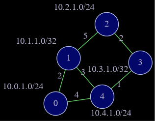

# Simulated IPv4 routing table generation

Considering a network where every router knows the topology, that is, each one contains the same Link State Database, fill the routing table of each router.

Uses Dijkstra's algorithm for shortest path finding and prefix trees for routing tables. Insertion and retrieval in the table is O(n), where n is the number of bits in the subnet address;

Topology visualization is generated as png with graphviz and dot in the 'dot' folder.


## Example




    Router 0 IPv4 Routing Table:
    SUBNET              GATEWAY
    10.0.1.0/24  |  10.0.1.0/24
    10.1.1.0/32  |  10.1.1.0/32
    10.2.1.0/24  |  10.1.1.0/32
    10.3.1.0/32  |  10.4.1.0/24
    10.4.1.0/24  |  10.4.1.0/24

    Router 1 IPv4 Routing Table:
    SUBNET              GATEWAY
    10.0.1.0/24  |  10.0.1.0/24
    10.1.1.0/32  |  10.1.1.0/32
    10.2.1.0/24  |  10.2.1.0/24
    10.3.1.0/32  |  10.4.1.0/24
    10.4.1.0/24  |  10.4.1.0/24

    Router 2 IPv4 Routing Table:
    SUBNET              GATEWAY
    10.0.1.0/24  |  10.3.1.0/32
    10.1.1.0/32  |  10.1.1.0/32
    10.2.1.0/24  |  10.2.1.0/24
    10.3.1.0/32  |  10.3.1.0/32
    10.4.1.0/24  |  10.3.1.0/32

    Router 3 IPv4 Routing Table:
    SUBNET              GATEWAY
    10.0.1.0/24  |  10.4.1.0/24
    10.1.1.0/32  |  10.4.1.0/24
    10.2.1.0/24  |  10.2.1.0/24
    10.3.1.0/32  |  10.3.1.0/32
    10.4.1.0/24  |  10.4.1.0/24

    Router 4 IPv4 Routing Table:
    SUBNET              GATEWAY
    10.0.1.0/24  |  10.0.1.0/24
    10.1.1.0/32  |  10.1.1.0/32
    10.2.1.0/24  |  10.3.1.0/32
    10.3.1.0/32  |  10.3.1.0/32
    10.4.1.0/24  |  10.4.1.0/24

    Enter Router ID:
    3
    Enter IPv4 Address: (ddd.ddd.ddd.ddd)
    10.0.1.127

    Retrieved: 10.0.1.0/24
    Gateway: 10.4.1.0/24
```


## Requirements

- graphviz
- dot


## Building
Clone the project
```bash
  git clone https://github.com/blr-ophon/IP_RoutingTable
```
Compile using:

```bash
  cd IP_RoutingTable
  make
```
## Running

Currently only executes a predefined topology
Run the executable directly or use make:

```bash
  make testrun
```


## Usage

Insert router and IPv4 address to retrieve. Topology png and dot is generated inside 'dot' folder

